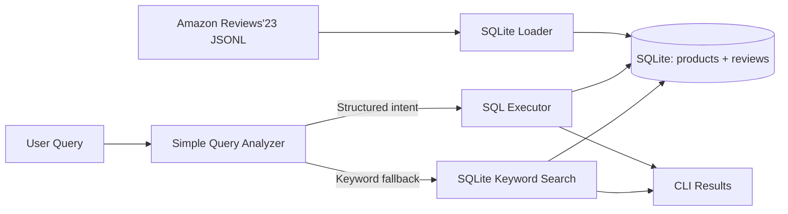

# Milestone 1 Status Report

## Team Organization

- Nathan Ko: SQLite schema, loader, SQL execution path, simple query analyzer
- Ethan Kusnadi: evaluation queries, milestone write-up, demo validation

## Server/System Software/Hardware Configuration

- Development environment: local Windows 10 workstation (`Windows-10-10.0.26200-SP0`)
- CPU: AMD Ryzen 7 5700X 8-Core Processor
- Memory: 34 GB RAM
- Language/runtime: Python 3.11.9
- Structured backend: SQLite 3.45.1
- Execution mode: CLI-only, CPU-oriented prototype

## Project Definition

The current milestone scope is intentionally narrow. The already-finished vector engine work and any FAISS discussion are excluded from this report. The deliverable here is a simple SQLite query analyzer, not a full routing engine.

### Functional Requirements

- Load one Amazon Reviews'23 category into SQLite
- Store product metadata and review text in a relational schema
- Support a very small set of structured queries over product fields
- Analyze a free-text query for simple intent detection
- Return top-k results with detected mode and timing information

### Non-Functional Requirements

- Keep setup simple for a class project
- Avoid extra infrastructure beyond SQLite
- Keep analyzer behavior deterministic and easy to explain
- Keep the milestone small enough to demo end to end

## Architecture

The prototype now uses a single-engine design. Structured data is loaded into SQLite, and a thin query analyzer maps user text to a few supported SQL patterns. If the text does not match one of those patterns, the system falls back to a basic keyword search over `products.search_text`.



## Scope So Far

### Research/Evaluation Methodology

- Use Amazon Reviews'23 because it contains both structured attributes and review text tied together by `parent_asin`
- Start with one category at a time to keep ingestion and evaluation manageable
- Use a small evaluation set with structured and keyword-style queries
- Measure detected intent, result relevance by inspection, and execution time

### Implementation Details

- Implemented SQLite schema for `products` and `reviews`
- Implemented database initialization and JSONL loading scripts
- Added a sample category for local testing
- Implemented a small SQL executor for top-rated and under-price queries
- Implemented a bare-bones query analyzer that detects only a few simple cases before falling back to keyword search
- Added a keyword fallback over `products.search_text`

### Requirements Implemented Thus Far

- Structured data ingestion: complete
- Relational schema and indexing: complete
- Sample dataset for local demo: complete
- Structured SQL execution path: complete for the current small query set
- Query analyzer: complete for current simple rules
- Keyword fallback: complete
- Vector engine and FAISS work: intentionally excluded from this report
- Full routing engine: intentionally not pursued in this version

## Prototype

### Terminal Snapshot: Database Load

```text
python scripts/load_amazon_reviews.py --db data/sqlite/query_analyzer.db --category All_Beauty --reviews data/sample/All_Beauty.sample.jsonl --metadata data/sample/meta_All_Beauty.sample.jsonl
Loaded metadata rows: 4 written, 0 skipped
Loaded review rows: 8 written, 0 skipped
SQLite database ready at ...\data\sqlite\query_analyzer.db
```

### Terminal Snapshot: Structured Query

```text
python scripts/run_query.py --db data/sqlite/query_analyzer.db --query "products under 15 dollars" --top-k 3
Analyzer mode: simple-sql
Normalized query: products under 15 dollars
Detected intent: products under price threshold
Matched keywords: under, dollars
Category filter: none
Store filter: none
Numeric threshold: 15.0
Search terms: none
Execution mode: products under price threshold
Top results:
  1. Volume Dry Shampoo
  2. Unscented Leave-In Conditioner
  3. Sea Salt Texture Spray
```

### Terminal Snapshot: Keyword Query

```text
python scripts/run_query.py --db data/sqlite/query_analyzer.db --query "lightweight hair product" --top-k 3
Analyzer mode: simple-sql
Normalized query: lightweight hair product
Detected intent: keyword product search
Matched keywords: none
Category filter: none
Store filter: none
Numeric threshold: none
Search terms: lightweight, hair
Execution mode: keyword product search
Top results:
  1. Sea Salt Texture Spray
  2. Hydrating Curl Cream
  3. Unscented Leave-In Conditioner
```

## Preliminary Results

- The structured pipeline works end to end on the sample category with 4 products and 8 reviews
- The analyzer correctly detects the small set of structured demo queries
- The keyword fallback returns plausible product titles based on simple matching against `products.search_text`
- The behavior is deterministic and easy to explain, which is useful for the milestone demo
- Complex semantic retrieval and mixed multi-engine routing are intentionally out of scope for this version

## Next Steps

- Run the same analyzer on a bounded real Amazon Reviews'23 category subset
- Expand the canned query set with more phrasing variants
- Tighten keyword scoring and tie-breaking if the demo results need it
- Add a small amount of quantitative evaluation for the supported query types

## Risks and Mitigation

- Risk: the rule-based analyzer may miss alternate wording
- Mitigation: keep the demo query set narrow and tune rules against concrete examples
- Risk: keyword search is only lexical matching, not semantic understanding
- Mitigation: present it as a simple fallback and avoid overstating its capabilities
- Risk: Amazon category files may be too large for naive local experiments
- Mitigation: use one category and row limits during milestone development
